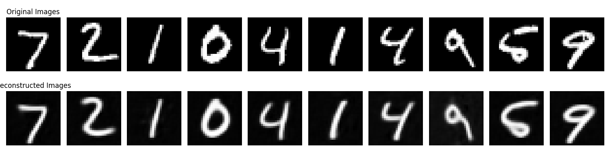
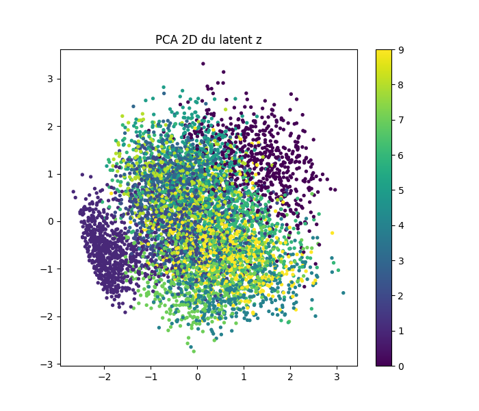
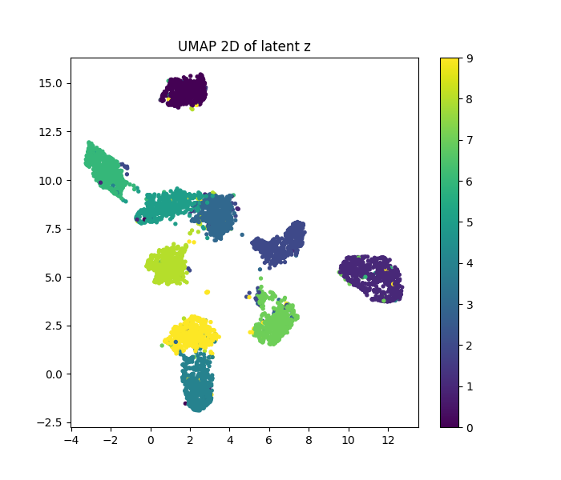
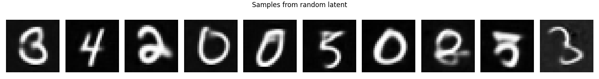
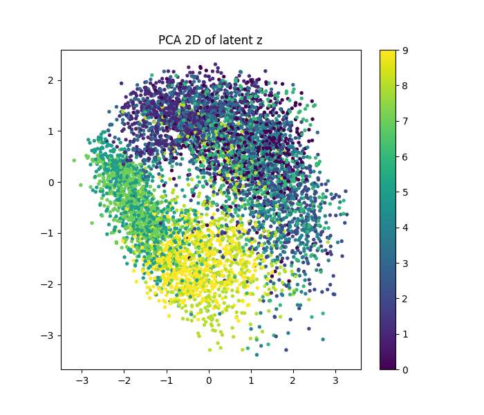
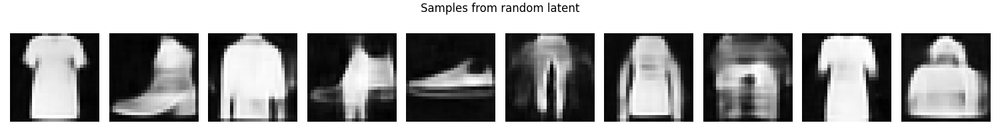
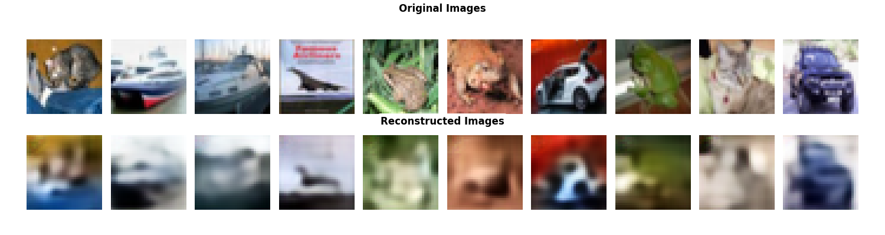
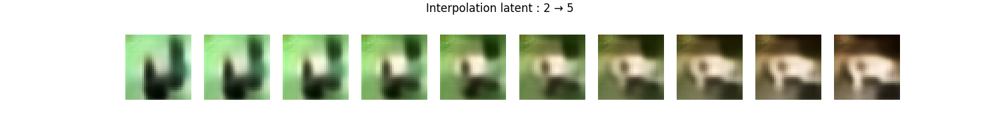

# Variational Autoencoder (VAE)

## Summary and visualizations

The VAE predicts μ and logvar for each input and uses the reparameterization trick to sample z. The loss combines reconstruction + KL divergence to a prior (N(0,1)). This changes behavior:

- The latent space is pushed toward the prior, which makes sampling from N(0,1) meaningful.
- Interpolations tend to be smoother and decoded samples from the prior are more coherent than for a plain AE.

Example placeholders:

<figure style="text-align: center;">
  
  <figcaption style="font-style: italic;">Figure: Originals vs VAE reconstructions. VAE reconstructions can be slightly blurrier depending on KL weight.</figcaption>
</figure>

<figure style="text-align: center;">
  
  <figcaption style="font-style: italic;">Figure: PCA 2D projection of VAE latent vectors, colored by digit label.</figcaption>
</figure>

- VAE PCA shows a more continuous embedding: latent vectors are more evenly distributed following the Gaussian prior.

<figure style="text-align: center;">
  
  <figcaption style="font-style: italic;">Figure: UMAP 2D projection of VAE latent vectors.</figcaption>
</figure>

- In the VAE case, UMAP show a smoother, more continuous manifold than the AE, thanks to KL regularization.

<figure style="text-align: center;">
  
  <figcaption style="font-style: italic;">Figure: Images decoded from samples drawn from N(0,I) in the VAE latent space.</figcaption>
</figure>

- These samples should look more digit-like than AE noise samples because the VAE latent is regularized toward the Gaussian prior.

## Fashion-MNIST example renders

Below are example placeholders from the Fashion-MNIST dataset. This dataset is more complex than MNIST, so reconstructions and latent embeddings can look less clean but we can still recognize structures of the items.

<figure style="text-align: center;">
  
  <figcaption style="font-style: italic;">Figure: Fashion-MNIST VAE PCA after 50 epochs.</figcaption>
</figure>

<figure style="text-align: center;">
  
  <figcaption style="font-style: italic;">Figure: Fashion-MNIST VAE samples drawn from the latent prior.</figcaption>
</figure>

## CIFAR-10 experiment (color images)

For CIFAR-10, the VAE is trained on 32×32 RGB images (3 channels). The KL regularization still encourages a smooth, Gaussian-like latent space, but the reconstructions are generally blurrier due to the complexity of natural color images.

<figure style="text-align: center;">
  
  <figcaption style="font-style: italic;">Figure: CIFAR-10 VAE reconstructions (epoch 50).</figcaption>
</figure>

<figure style="text-align: center;">
  
  <figcaption style="font-style: italic;">Figure: CIFAR-10 VAE PCA projection (epoch 50).</figcaption>
</figure>

<figure style="text-align: center;">
  
  <figcaption style="font-style: italic;">Figure: CIFAR-10 VAE interpolation (epoch 50).</figcaption>
</figure>

Notes:
- Samples from the prior tend to look more “colorful blobs” than sharp objects at small resolutions.
- Interpolations are smoother and often show gradual shifts in color and texture.
- PCA/UMAP embeddings are less cleanly separated because CIFAR-10 classes overlap more in pixel space. However, we clearly see a distribution that fills the latent space more evenly.

## Code
- Model: `VAE`, `VAE_Encoder`, `VAE_Decoder`, plus `PP` variants in `modules/vae/vae.py`.
- Training loop: `modules/vae/training.py`.
- CLI entry point: `main.py`.

## Training
Examples:

- MNIST
  - `python main.py --model VAE --dataset mnist --latent_dim 64`
- Fashion-MNIST
  - `python main.py --model VAE --dataset fashion_mnist --latent_dim 128`

PP mode (deeper encoder/decoder):
- `python main.py --model VAE --dataset mnist --latent_dim 64 --vae_mode pp`

## Outputs
- Checkpoints: `models/VAE/`
- Visuals: `visu/<dataset>_vae/` with `recon/`, `pca/`, `umap/`, `interp/`, `noise/`. ( if enabled in `main.py` )

